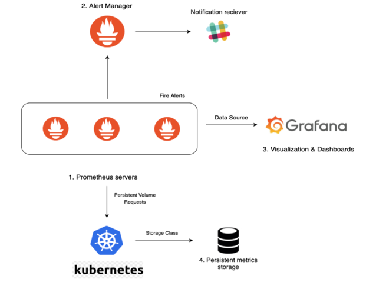

## Prometheus 란?



1. 시계열 데이터(time series) 저장하는 오픈소스 모니터링 / 알림 시스템
2. 쿠버네티스, 노드, 프로메테우스 자체를 모니터링 할 수 있음
3. 사용자가 데이터를 질의 (PromQL) 할 수 있는 Web UI가 존재함
4. 프로메테우스 서버는 다양한 export 로 부터 각 대상의 메트릭을 pull 하여 주기적으로 가져오는 모니터링 시스템  
   => 쿠버네티스 관련 메트릭 가져오기 - exporter  
   => mongoDB 관련 메트릭 가져오기 - mongoDB exporter
5. 다양한 지표(metric) 수집 및 저장  
   => 이를 기반으로한 경고 알림 (alerting) 및 대시보드 작성 지원함

## Prometheus 는 시각화 도구로 Grafana 를 권장함.

- 데이터를 그래프, 표, 대시보드 등으로 표현하고 경고 알림을 지원함
  => 데이터 소스 기반 경고 및 알람 발송 가능
- 이미 만들어진 Grafana 플러그인, 템플릿이 많아 대시보드 구성이 쉬움

## 주의

- 데이터 수집과 저장방식이 Push 방식이 아닌 Pull 방식이라 Exporter 를 대상 시스템에 직접 설치 해야함
- 프로메테우스가 직접 데이터를 저장하기 때문에 영속성과 저장 용량에 대한 고려가 필요함. 성능 이슈

## 스프링 연동

### 1. 스프링 서버 설정

- Spring Actuator 를 통해 필요한 관리 API 만 선택적으로 노출하는 것을 권장한다.
- `/actuator/prometheus` 엔드포인트를 통해 프로메테우스 메트릭 제공하자.

```kotlin
implementation("org.springframework.boot:spring-boot-starter-actuator")
runtimeOnly("io.micrometer:micrometer-registry-prometheus")
```

```yml
management:
  endpoints:
    web:
      exposure:
        include: health, info, metrics, prometheus # 실제 서비스에서는 필요한 정보만 노출하자.
  metrics:
    distribution:
      percentiles-histogram:
        api-trace-request-duration-seconds: true    # 히스토그램 ON
      percentiles:
        api-trace-request-duration-seconds: 0.5,0.95,0.99
    enable:
      all: true
  prometheus:
    metrics:
      export:
        enabled: true
```

위 설정은 `GET {{host}}/actuator` 호출 시 아래와 같이 나온다.

```json
{
  "_links": {
    "self": {
      "href": "http://localhost:8080/actuator",
      "templated": false
    },
    "prometheus": {
      "href": "http://localhost:8080/actuator/prometheus",
      "templated": false
    }
  }
}
```

### 2. Prometheus 설치 (https://prometheus.io/download/)

도커로 설치 후 http://localhost:9090/query 으로 접속하자.

```yml
# ./prometheus.yml
global:
  scrape_interval: 15s

scrape_configs:
  - job_name: 'test-grafana'
    metrics_path: '/actuator/prometheus'
    static_configs:
      - targets: [ 'host.docker.internal:8080' ]
        labels:
          application: 'test-grafana'
```

```yml
# ./docker-compose.yml
services:
  prometheus:
    image: prom/prometheus
    ports:
      - "9090:9090"
    volumes:
      - ./prometheus.yml:/etc/prometheus/prometheus.yml # ./prometheus.yml
```

## 3. Grafana 설치 (https://grafana.com/grafana/download)

편의를 위해 grafana.yml 로 프로메테우스를 바로 연결했는데, localhost:3000 접속 후 `좌측 네비바 -> Connections -> Add DataSource -> Prometheus` 로 직접
연결 할 수 있다.

```yml
# ./grafana.yml
apiVersion: 1
datasources:
  - name: Prometheus
    type: prometheus
    access: proxy
    url: http://prometheus:9090
    isDefault: true
```

```yml
# ./docker-compose.yml
services:
  grafana:
    image: grafana/grafana
    ports:
      - "3000:3000"
    environment:
      - GF_SECURITY_ADMIN_USER=admin
      - GF_SECURITY_ADMIN_PASSWORD=admin
    depends_on:
      - prometheus
    volumes:
      - grafana-data:/var/lib/grafana
      - ./grafana.yml:/etc/grafana/provisioning/datasources/datasource.yml # ./grafana.yml

volumes:
  grafana-data:
```

대시보드는 https://grafana.com/grafana/dashboards/ 에서 가입 후 다운로드 가능하다.  
좌측 Dashboards -> 우측상단 New -> Import -> `대시 보드 ID` 또는 `.json` 으로 Import 하면 된다.  
추천 대시보드 ID : 4701 (JVM Metrics)
