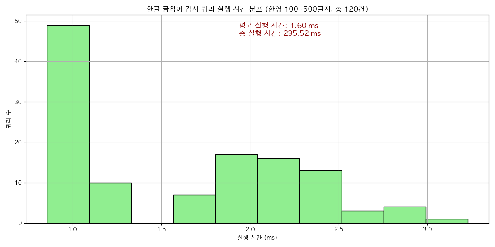
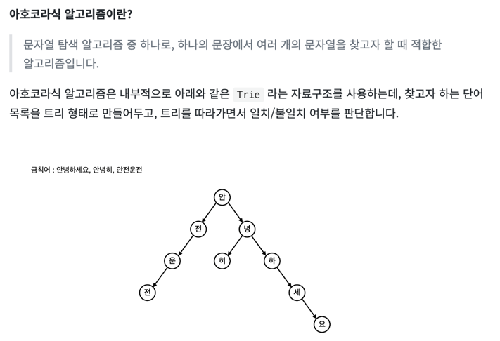
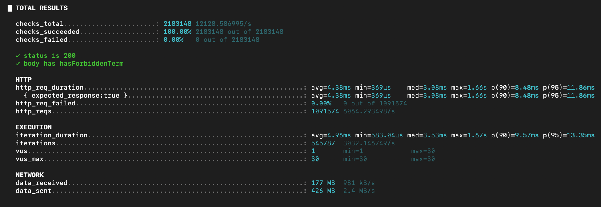
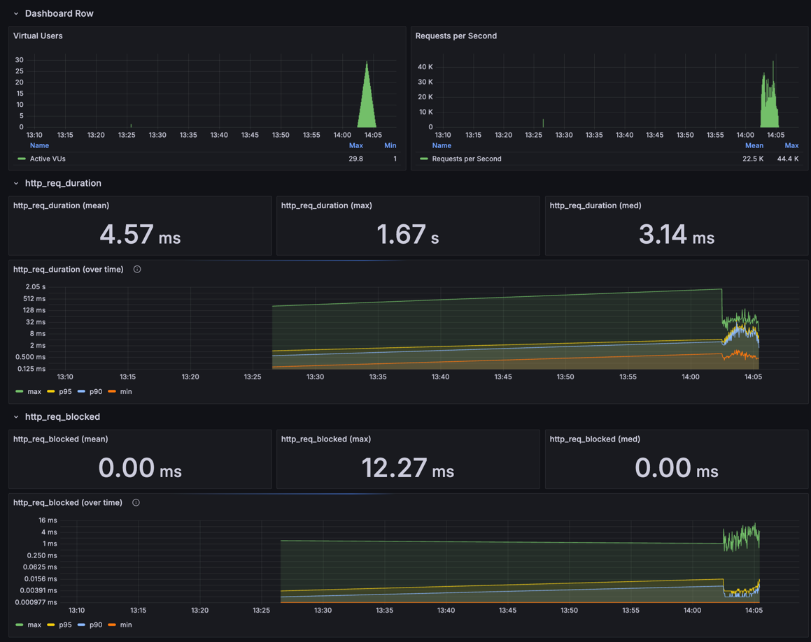
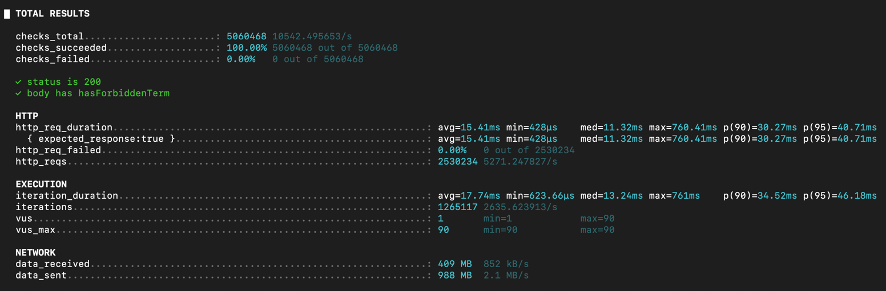
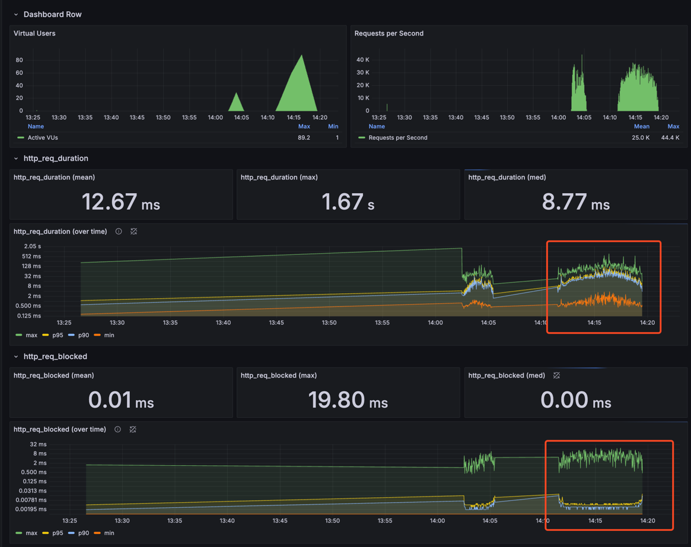
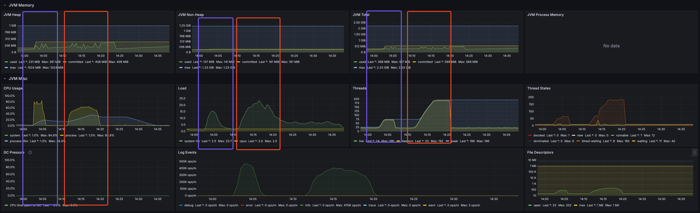
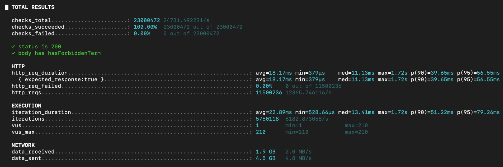
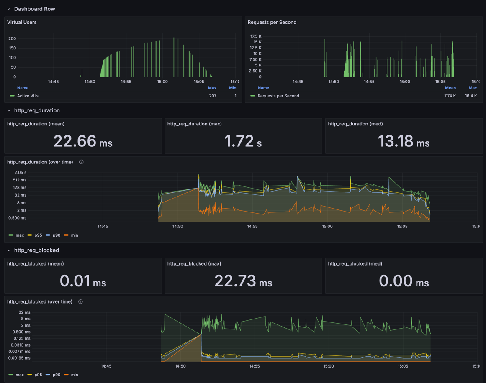

## 금칙어 검사기

금칙어 감지 시스템 개발 단계 정리.

### 1️⃣ 어디까지 구현할 것인가?

> 금칙어 리스트는 DB에 저장되어 있다. 메모리에 올려서 검사하며 업데이트 시 주기적으로 동기화가 필요하다.  
> Lv2까지 먼저 구현하고, 성능 테스트 후 Lv3, Lv4는 필요 시 고려함.

- **Lv1. 금칙어와 완전 일치하는 경우**
    - 예시: `fuck`, `shit`, `bitch`, `병신`, `씨발`, `개새끼`


- **Lv2. 특수문자, 띄워쓰기, 반복된 글자로 금칙어를 구성하는 경우**
    - 예시: `f*u*c*k`, `fu  ck`, `shiiiit`, `b i t c h`, `f u c k y o u`, `ㅅㅂ`, `ㅂㅅ`, `ㅗㅗ`, `개   새 끼`, `ㅆ ㅣ ㅂ ㅏㄹ`


- **Lv3. 허용된 문자가 포함되어 금칙어로 인식하면 안되는 경우 (금칙어가 포함되었으나, 금칙어가 아닌 명사)**
    - 예시: `리조또`, `assassin`, `Scunthorpe`, `class`, `bitchez`, `funky`, `병원`, `씨앗`, `개미`


- **Lv4. BERT 등 금칙어 딥러닝 모델을 활용하는 경우 (의미기반 탐지)**
    - 예시: `go jump off a bridge`, `you’re such trash`, `no one likes you anyway`, `너 같은 건 없어져야 돼`,
      `그 입 다물고 머리 박고 골로가라`

### 2️⃣ 개발 단계

**1. 가장 간단한 방법 DB Like 쿼리**

- 금칙어 리스트 하나하나에 대해 입력 문자열에 포함돼 있는지 `LOWER(:input) LIKE '%' || term || '%'`
- 장) 전처리가 필요없고 구현이 간단하다. 만개 이하의 테이블에선 full-scan 도 충분히 빠르다.
- 단) 인덱스를 탈 수 없는 구조이기에 금칙어가 수천~수만 개로 커지거나 동시 요청, 수정이 많아지면 성능이 급격히 떨어질 수 있음



<br/>


**2. 아호클래식 트리**

> 검색 시간복잡도: O(T+Z) == O(입력 텍스트 길이 + 총 매칭된 패턴 수)
- 여러 금칙어 패턴을 글자별 트리 구조로 쌓음.
- 텍스트를 앞에서부터 한 글자씩 읽으면서 트리를 따라감.
- 실패 링크(Fail link)
    - he를 검사하다가 다음 글자가 r인데 트라이에 her이 없다면, 실패 링크를 따라가 e가 끝인 다른 패턴으로 이동



- 서버 실행시 DB 를 읽어 금칙어 리스트를 형태소 분리 후 메모리에 올림
- 입력 -> 정규표현식으로 특수문자 제거 `Regex("[^\\p{L}\\p{N}]+")`
    - 로컬 캐시(caffeine) 에 이미 처리된 문자인지 확인
    - 캐시에 없다면 아호클래식 트리로 탐색
        - 1 입력한 문자열을 형태소 분리 `("나쁜kdqwodj 욕1설 -> 나쁜, kdqwodj, 욕, 1, 설")`
        - 2-1 단일 형태소 트리 검사 `(나쁜, 욕, 설)`
        - 2-2 형태소 조합 후 검사, 최대 8개 `("나쁜, 욕 설" -> 나쁜욕, 욕설, 나쁜욕설)`
        - 2-3 전체 형태소를 한 번에 붙인 문자열도 검사 `("나쁜욕설")`
    - 위 과정중 하나라도 발견되면 금칙어로 판단 후 다음 과정을 중지하고 바로 반환.

### 3️⃣ 아호클래식 테스트

서버와 db는 각각 `2core 4g` 로 리소스 제한  
DB에 무작위 금칙어 2000개  
입력 100~500글자 내외로 랜덤하게 생성


> 1차 테스트 0~30 1분

```js
stages: [
    {duration: '30s', target: 10},
    {duration: '1m', target: 30},
    {duration: '1m30s', target: 0},
]
```

- 총 109만 건 요청
- 평균 응답속도 4.38ms, 95%가 11.86ms 이하로 응답, 최대 지연 1.66초

- 
- 

---

> 2차 테스트 0 ~ 90 2분

```js
stages: [
    {duration: '30s', target: 10},
    {duration: '1m', target: 30},
    {duration: '1m30s', target: 60},
    {duration: '2m', target: 90},
    {duration: '3m', target: 0},
]

```

- 총 506만건 요청
- 평균 응답속도 12.67ms, 95%가 32ms 이하로 응답, 최대 지연 1.67초
    - 1차 테스트 보다 3배 지연
- 
- 
- 


> 3차 테스트
```
stages: [
    {duration: '30s', target: 90},
    {duration: '1m', target: 120},
    {duration: '2m', target: 150},
    {duration: '3m', target: 180},
    {duration: '4m', target: 210},
    {duration: '5m', target: 0},
]
```
- 캐시 제거
- 
- 